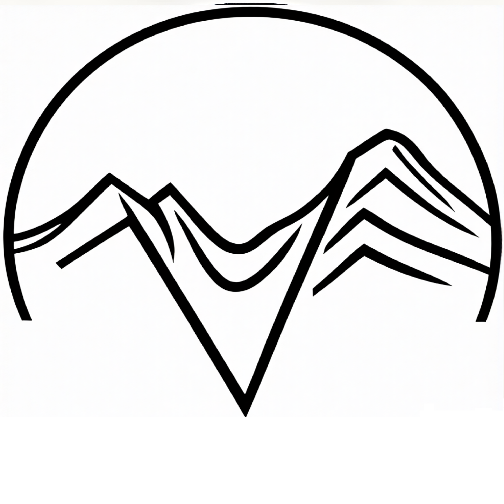
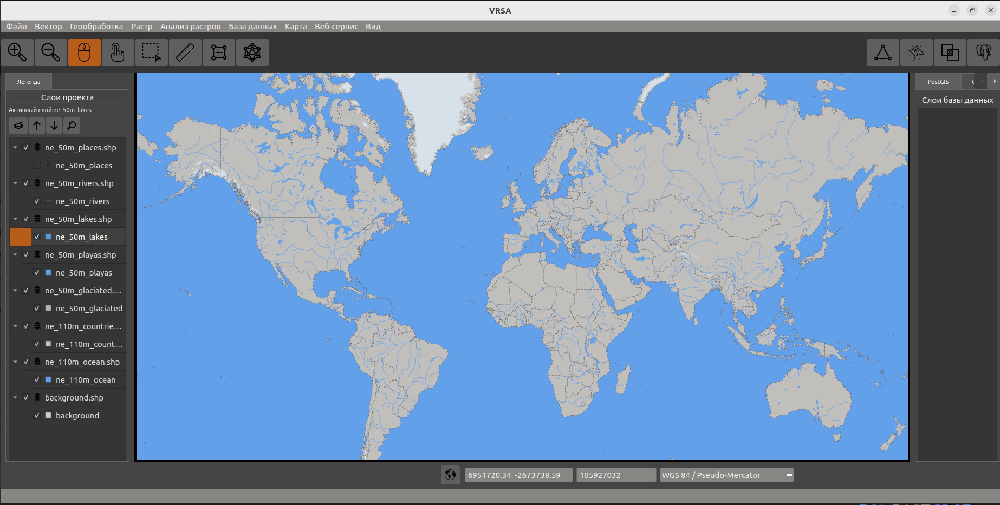
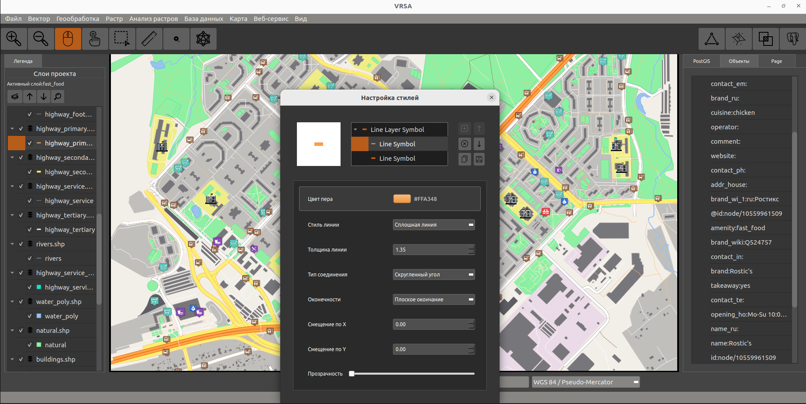
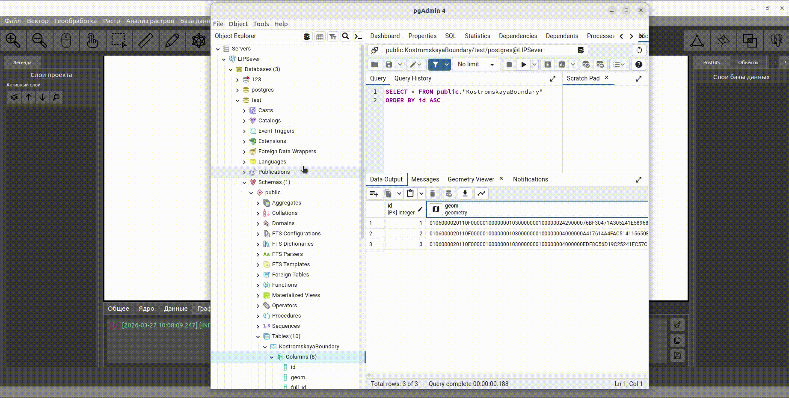
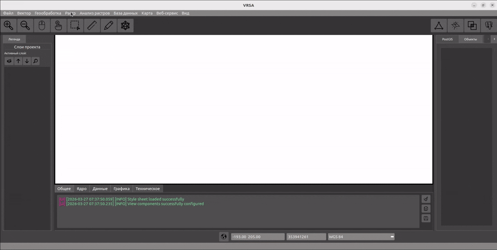
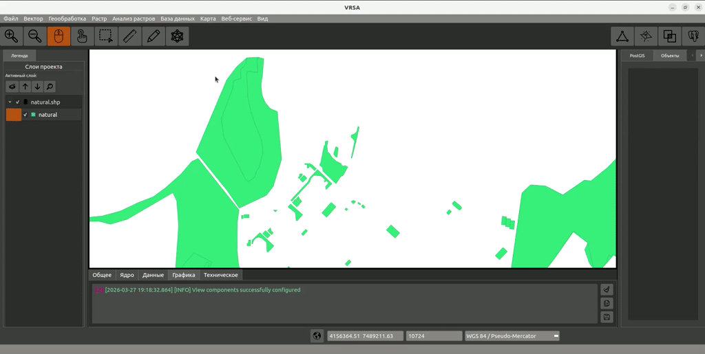
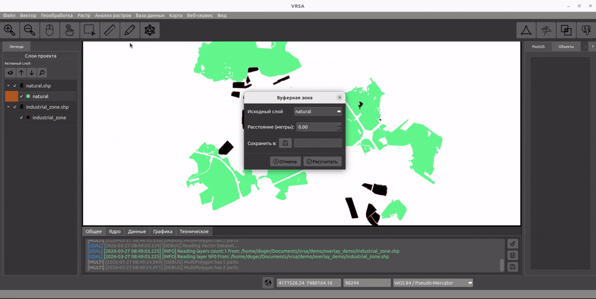
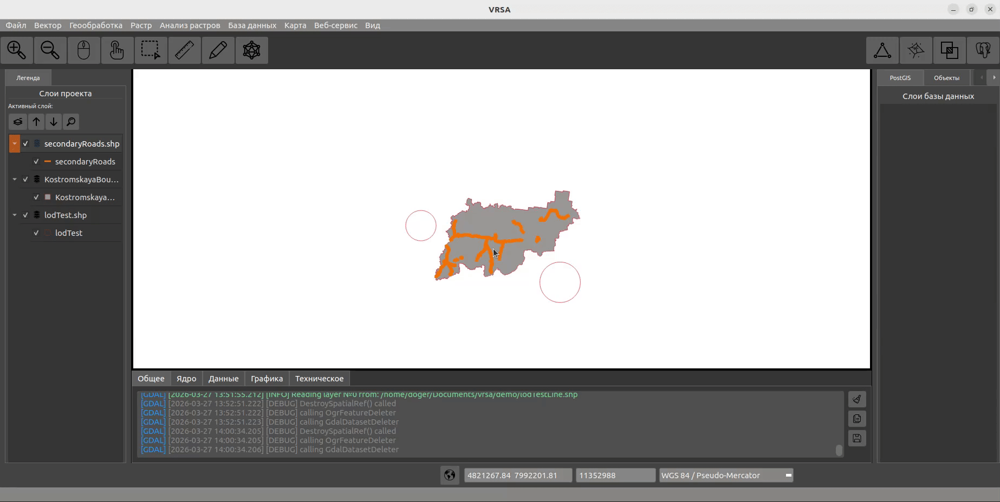
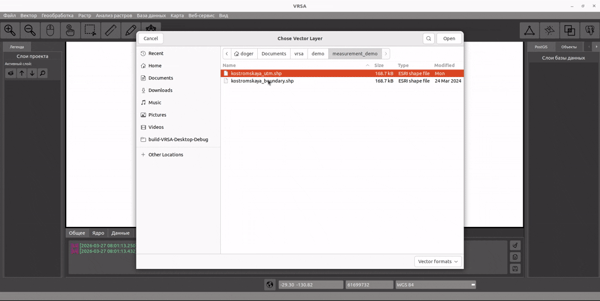
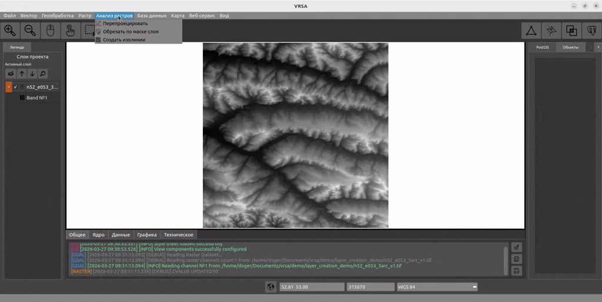

# VRSA — Vector Raster Spatial Analysis

**Геоинформационная система для работы с векторными и растровыми данными**


*Обзорная карта мира. Данные: [Natural Earth](https://www.naturalearthdata.com/) (масштабы 1:110 млн и 1:50 млн).*

---

## О проекте

VRSA — это ГИС, разработанная с нуля на C++/Qt. Поддерживает векторные и растровые данные, пространственный анализ, тайловые сервисы и работу с базами данных.

---

## Возможности

### Векторные данные
- Чтение/запись: Shapefile, PostGIS, Spatialite, GPKG и др.
- Редактор геометрии (точки, линии, полигоны) с undo/redo
- Функции оцифровки
- Стилизация (цвет, толщина, прозрачность, символы)

### Растровые данные
- Чтение: GeoTIFF, JPEG, PNG и др.
- Инструменты: обрезка, перепроецирование, изолинии
- Поддержка тайловых картографических сервисов (TMS, XYZ)

### Пространственный анализ (GEOS)
- Буфер
- Пересечение, объединение, разность
- Упрощение геометрии
- Триангуляция Делоне
- Диаграммы Вороного

### Системы координат
- WGS84, Pseudo-Mercator, отечественные проекции и системы координат: ГСК-2011, ПЗ-90.11 и др.
- Перепроецирование векторных и растровых слоев
- Измерения: плоскостные и геодезические (с выбором эллипсоида)

### Интерфейс
- Тёмная тема
- Адаптивный интерфейс с возможностью скрывать панели
- Инструменты для работы с картой: панорамирование, масштабирование, линейка, выделение, оцифровка, редактирование геометрии
- Меню с инструментами геопроцессинга
- Управление слоями (вкл/выкл, z-value)

---

## Демонстрация

### 1. Источники данных

#### Векторные данные
*Загрузка и визуализация векторных слоёв. Для демонстрации используются открытые данные [OpenStreetMap](https://www.openstreetmap.org/).*


#### Кастомная стилизация векторных слоёв
*Настройка цветовых схем, толщин линий, заливок и точечных символов.*


#### Тайловые картографические сервисы (TMS, XYZ). 
*Для демонстрации используется XYZ-сервис [OpenStreetMap](https://wiki.openstreetmap.org/wiki/Tile_servers).*


#### Работа с базами данных PostgreSQL с расширением [PostGIS](https://postgis.net/).


###  2. Создание и редактирование

#### Создание векторного слоя и функция оцифровки
*Оцифровка полигона по синтезированному в естественных цветах снимку [Landsat 8](https://www.usgs.gov/landsat-missions/landsat-8).*


#### Редактирование геометрии существующего объекта
*Резиновые линии (rubber bands) и контрольные точки. Перемещение вершин, создание новых сегментов кликом по середине грани. Каждое изменение сохраняется в истории — Undo/Redo доступны в любой момент.*


### 3. Пространственный анализ

#### Оверлейные операции
*Буфер и пересечение. Демонстрация поиска зон конфликта: буферная зона вокруг промзон (1000 м) и пересечение с лесными массивами (natural). Выявление территорий, попадающих под влияние промышленных объектов.*


#### Триангуляция Делоне и диаграммы Вороного
*Пространственный анализ точечных данных. Триангуляция Делоне строит сеть связей между точками (города). Диаграмма Вороного делит пространство на зоны влияния ближайших объектов.*
*Данные: населённые пункты ([Natural Earth](https://www.naturalearthdata.com/), масштаб 1:50 млн).*


#### LOD (Level of Detail)
*Автоматическое упрощение геометрии на лету для данных в проекционных системах координат. При отдалении камеры объекты отрисовываются с меньшим количеством вершин, что ускоряет рендеринг.*



#### Измерения
*Расчёт расстояний двумя способами: плоскостной (евклидово расстояние) и геодезический (с учётом кривизны Земли). На гифке последовательно загружается полигон в WGS84 (географические координаты) и в UTM (проекция), результаты измерений на эллипсоиде и на плоскости сопоставимы.*


### 4. Растровая обработка

#### Изолинии из цифровой модели рельефа (DEM)
*Генерация изолиний по данным [SRTM](https://www.earthdata.nasa.gov/data/instruments/srtm) (Shuttle Radar Topography Mission).*



---

## Технологии

| Технология | Назначение |
|------------|------------|
| C++17 | Язык программирования |
| CMake | Кроссплатформенная сборка |
| Qt 5 | Графический интерфейс и рендеринг |
| GDAL | Работа с геоданными |
| GEOS | Пространственный анализ |
| PostgreSQL/PostGIS | Пространственные базы данных |


---

## Источники данных

| Данные | Источник |
|--------|----------|
| Обзорные карты (границы, озёра, реки, города) | [Natural Earth](https://www.naturalearthdata.com/) |
| Детальные векторные данные (дороги, здания, POI) | [OpenStreetMap](https://www.openstreetmap.org/) |
| Тайловая подложка | [OpenStreetMap](https://www.openstreetmap.org/) (XYZ) |
| Цифровая модель рельефа (DEM) | [SRTM](https://www2.jpl.nasa.gov/srtm/) |
| Спутниковые снимки | [Landsat 8](https://www.usgs.gov/landsat-missions/landsat-8) |

---


## Установка и сборка

### Linux (Ubuntu/Debian)

```bash
# Установка зависимостей
sudo apt install qt5-default libgdal-dev libgeos-dev

# Клонирование
git clone https://github.com/Doggerr111/vrsa-gis.git
cd vrsa-gis

# Сборка
mkdir build && cd build
cmake ..
make -j$(nproc)
